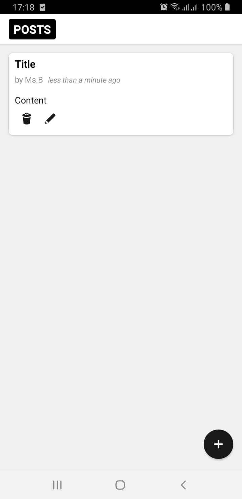
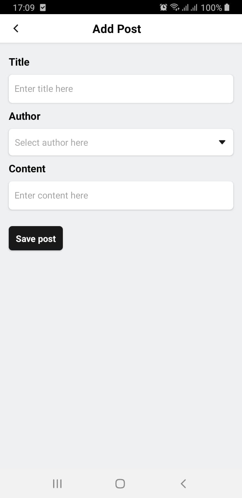

## Project Description

A basic react native app using Redux Toolkit

## App images

<p align="left">


</p>


## Getting Started

#### 1. Clone and Install

```bash
# Clone the repo
git clone https://github.com/maxiromanoff/post_redux

# Navigate to clonned folder and Install dependencies
cd post_redux && yarn install

# Install Pods
npx pod-install
```

#### 2. Open RNS in your iOS simulator

Run this command to start the development server and to start your app on iOS simulator:
```
yarn run ios
```

Or, if you prefer Android:
```
yarn run android
```


## LICENSE